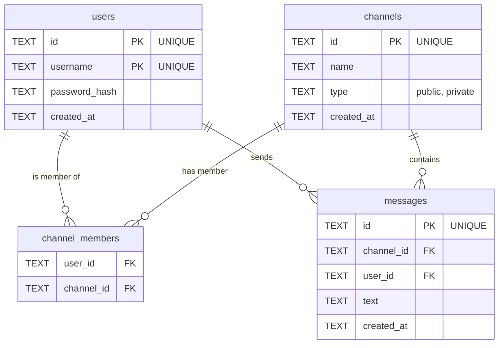

# Projekt Schematu Bazy Danych (SQLite)

Dokument ten opisuje strukturę bazy danych dla aplikacji AI-Powered Team Chat. Baza danych zostanie zaimplementowana w technologii SQLite ze względu na jej prostotę i brak potrzeby konfiguracji serwera.

## 1. Diagram Relacji Encji (ERD)

Poniższy diagram przedstawia kluczowe tabele i relacje między nimi.

## 2. Opis Tabel

### Tabela: `users`

Przechowuje informacje o zarejestrowanych użytkownikach.

| Nazwa Kolumny   | Typ Danych | Opis                                                                 |
| --------------- | ---------- | -------------------------------------------------------------------- |
| `id`            | `TEXT`     | Unikalny identyfikator użytkownika (Primary Key, np. UUID).          |
| `username`      | `TEXT`     | Unikalna nazwa użytkownika, używana do logowania (3-20 znaków).      |
| `password_hash` | `TEXT`     | Zahaszowane hasło użytkownika. Nigdy nie przechowujemy haseł jawnie. |
| `created_at`    | `TEXT`     | Znacznik czasu utworzenia konta (format ISO 8601).                   |

### Tabela: `channels`

Przechowuje informacje o kanałach publicznych i prywatnych.

| Nazwa Kolumny | Typ Danych | Opis                                                                                             |
| ------------- | ---------- | ------------------------------------------------------------------------------------------------ |
| `id`          | `TEXT`     | Unikalny identyfikator kanału (Primary Key, np. "general" lub "dm_user1_user2").                 |
| `name`        | `TEXT`     | Wyświetlana nazwa kanału (np. "Ogólny"). W przypadku rozmów 1-na-1, to nazwa drugiego użytkownika. |
| `type`        | `TEXT`     | Typ kanału. Dopuszczalne wartości: `'public'` lub `'private'`.                                   |
| `created_at`  | `TEXT`     | Znacznik czasu utworzenia kanału (format ISO 8601).                                              |

### Tabela: `messages`

Przechowuje historię wszystkich wiadomości wysłanych na kanałach.

| Nazwa Kolumny | Typ Danych | Opis                                                                  |
| ------------- | ---------- | --------------------------------------------------------------------- |
| `id`          | `TEXT`     | Unikalny identyfikator wiadomości (Primary Key).                       |
| `channel_id`  | `TEXT`     | Klucz obcy wskazujący na tabelę `channels`, do którego kanału należy. |
| `user_id`     | `TEXT`     | Klucz obcy wskazujący na tabelę `users`, kto jest autorem.            |
| `text`        | `TEXT`     | Treść wiadomości (do 300 znaków).                                      |
| `created_at`  | `TEXT`     | Znacznik czasu wysłania wiadomości (format ISO 8601).                  |
| `edited_at`   | `TEXT`     | Znacznik czasu ostatniej edycji (NULL, jeśli nie edytowano).          |

### Tabela: `channel_members`

Tabela łącząca (pivot table) definiująca relację wiele-do-wielu między użytkownikami a kanałami. Określa, którzy użytkownicy należą do których kanałów.

| Nazwa Kolumny | Typ Danych | Opis                                                        |
| ------------- | ---------- | ----------------------------------------------------------- |
| `user_id`     | `TEXT`     | Klucz obcy wskazujący na `users.id`.                        |
| `channel_id`  | `TEXT`     | Klucz obcy wskazujący na `channels.id`.                     |
| *Klucz główny* | -          | Złożony klucz główny na (`user_id`, `channel_id`).          |

### Tabela: `message_reactions`

Przechowuje informacje o reakcjach emoji dodanych do wiadomości.

| Nazwa Kolumny | Typ Danych | Opis                                             |
|---------------|------------|--------------------------------------------------|
| `message_id`  | `TEXT`     | Klucz obcy wskazujący na `messages.id`.          |
| `user_id`     | `TEXT`     | Klucz obcy wskazujący na `users.id` (kto zareagował). |
| `emoji`       | `TEXT`     | Znak emoji użyty w reakcji (np. "👍").                           |
| `created_at`  | `TEXT`     | Znacznik czasu dodania reakcji (format ISO 8601).                   |
| *Klucz główny*| -          | Złożony klucz główny na (`message_id`, `user_id`, `emoji`). |

## 3. Wyjaśnienie Relacji

-   **Użytkownicy i Kanały (`channel_members`)**: Relacja wiele-do-wielu. Jeden użytkownik może należeć do wielu kanałów, a jeden kanał może mieć wielu użytkowników.
-   **Użytkownicy i Wiadomości**: Relacja jeden-do-wielu. Jeden użytkownik może wysłać wiele wiadomości.
-   **Kanały i Wiadomości**: Relacja jeden-do-wielu. Jeden kanał zawiera wiele wiadomości.
-   **Wiadomości i Reakcje**: Wiadomość może mieć wiele reakcji od wielu użytkowników. Tabela `message_reactions` łączy użytkowników i wiadomości poprzez konkretne emoji.

Ten schemat jest wystarczająco elastyczny, aby obsłużyć wszystkie zdefiniowane historyjki użytkownika, w tym kanały publiczne i rozmowy prywatne (które technicznie są po prostu kanałami typu `'private'` z dwoma członkami).
