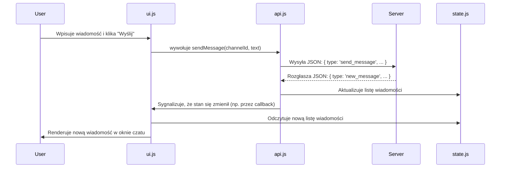

# Architektura Aplikacji Frontendowej

Dokument ten opisuje architekturę, strukturę i przepływ danych dla aplikacji klienckiej (frontend) projektu AI-Powered Team Chat. Została ona zaprojektowana z myślą o prostocie, czytelności i celach edukacyjnych, opierając się na technologiach Vanilla JavaScript, HTML i CSS.

## 1. Główne Zasady

-   **Prostota (No-Build-Tools)**: Aplikacja nie wymaga żadnych narzędzi do budowania (np. Webpack, Node.js). Można ją uruchomić, otwierając plik `index.html` bezpośrednio w przeglądarce.
-   **Separacja Odpowiedzialności (Separation of Concerns)**: Kod jest podzielony na logiczne moduły, z których każdy ma jasno zdefiniowaną rolę. Pomaga to w zrozumieniu i utrzymaniu aplikacji.
-   **Centralizacja Stanu (Single Source of Truth)**: Wszystkie dane, które definiują aktualny stan aplikacji (np. kto jest zalogowany, jaka jest lista wiadomości), są przechowywane w jednym, centralnym miejscu.

## 2. Struktura Katalogów

Struktura plików w katalogu `project/client/` będzie wyglądać następująco:

```
project/client/
├── index.html          # Główny plik HTML, struktura aplikacji
├── style.css           # Arkusz stylów CSS
└── js/
    ├── main.js         # Punkt startowy aplikacji, inicjalizacja
    ├── api.js          # Moduł do komunikacji z serwerem WebSocket
    ├── ui.js           # Moduł do manipulacji interfejsem (DOM)
    └── state.js        # Moduł do zarządzania stanem aplikacji
```

## 3. Opis Modułów JavaScript

### `js/state.js`
-   **Rola**: Przechowywanie stanu aplikacji. Jest to "jedno źródło prawdy" dla całej aplikacji.
-   **Zawartość**: Eksportuje pojedynczy obiekt (np. `const state = { ... }`), który zawiera wszystkie kluczowe dane, takie jak:
    -   Informacje o zalogowanym użytkowniku (`currentUser`).
    -   Lista dostępnych kanałów (`channels`).
    -   Aktywny kanał (`activeChannelId`).
    -   Lista użytkowników online (`onlineUsers`).
    -   Wiadomości dla każdego kanału (`messages: { channelId: [...] }`).
-   **Zasada**: Ten plik **nie zawiera logiki** manipulującej DOM ani wysyłającej dane do serwera. Jego jedynym zadaniem jest przechowywanie danych.

### `js/api.js`
-   **Rola**: Zarządzanie komunikacją z backendem przez WebSocket.
-   **Zawartość**:
    -   Funkcje do nawiązywania i zamykania połączenia WebSocket.
    -   Funkcje "opakowujące" wysyłanie wiadomości do serwera, zgodne ze specyfikacją w `api_design.md` (np. `sendAuthRequest(username, password)`, `sendMessage(channelId, text)`).
    -   Główny "odbiornik" (`socket.onmessage`), który parsuje przychodzące wiadomości z serwera, a następnie **aktualizuje dane w `state.js`** i informuje inne moduły (np. przez wywołanie funkcji zwrotnej) o nowym stanie.

### `js/ui.js`
-   **Rola**: Renderowanie interfejsu użytkownika i obsługa interakcji.
-   **Zawartość**:
    -   Referencje do kluczowych elementów DOM (np. okno czatu, lista kanałów, pole do wpisywania wiadomości).
    -   Funkcje renderujące, które pobierają dane **bezpośrednio z `state.js`** i na ich podstawie generują HTML (np. `renderMessages()`, `renderUserList()`).
    -   Funkcje dodające "słuchaczy zdarzeń" (event listeners) do elementów HTML, które w odpowiedzi na akcję użytkownika (np. kliknięcie przycisku "Wyślij") wywołują odpowiednie funkcje z `api.js`.
-   **Zasada**: Ten moduł **nie powinien przechowywać własnego stanu** ani bezpośrednio komunikować się z serwerem.

### `js/main.js`
-   **Rola**: Punkt wejścia aplikacji. Inicjalizuje i łączy wszystkie moduły.
-   **Zawartość**:
    -   Kod, który uruchamia się po załadowaniu strony.
    -   Inicjalizuje połączenie WebSocket za pomocą `api.js`.
    -   Ustawia początkowe `event listeners` za pomocą `ui.js`.
    -   Orkiestruje przepływ danych, np. instruuje `ui.js`, aby odświeżył widok, gdy `api.js` zasygnalizuje otrzymanie nowych danych.

## 4. Przepływ Danych (Data Flow)

Typowy cykl interakcji w aplikacji będzie przebiegał następująco:



## 5. Komponenty Interfejsu Użytkownika

### Layout Główny (`index.html`)
Aplikacja będzie miała klasyczny układ trzech kolumn, inspirowany Slackiem/Discordem:

```
┌─────────────────────────────────────────────────────────┐
│                    Header Bar                           │
├─────────────┬─────────────────────────┬─────────────────┤
│             │                         │                 │
│   Channel   │      Chat Window        │   User List     │
│   Sidebar   │                         │   Sidebar       │
│             │                         │                 │
│             │                         │                 │
│             │─────────────────────────│                 │
│             │    Message Input Box    │                 │
└─────────────┴─────────────────────────┴─────────────────┘
```

### Komponenty UI i ich Odpowiedzialności

#### 1. **Header Bar** (`#header`)
- **Zawartość**: Logo aplikacji, nazwa aktualnego kanału, przycisk wylogowania
- **Funkcje w `ui.js`**:
  - `updateHeaderChannelName(channelName)` - aktualizuje wyświetlaną nazwę kanału
  - `setupLogoutButton()` - dodaje event listener do przycisku wylogowania

#### 2. **Channel Sidebar** (`#channel-sidebar`)
- **Zawartość**: Lista dostępnych kanałów publicznych + sekcja "Direct Messages"
- **Struktura HTML**:
  ```html
  <div id="channel-sidebar">
    <div class="channels-section">
      <h3>Kanały</h3>
      <ul id="channels-list">
        <!-- Dynamicznie generowane elementy kanałów -->
      </ul>
    </div>
    <div class="dm-section">
      <h3>Wiadomości prywatne</h3>
      <ul id="dm-list">
        <!-- Dynamicznie generowane rozmowy prywatne -->
      </ul>
    </div>
  </div>
  ```
- **Funkcje w `ui.js`**:
  - `renderChannelList()` - renderuje listę kanałów publicznych z `state.channels`
  - `renderDMList()` - renderuje listę rozmów prywatnych
  - `highlightActiveChannel(channelId)` - podświetla aktualnie wybrany kanał
  - `setupChannelClickHandlers()` - dodaje event listenery do kliknięć na kanały

#### 3. **Chat Window** (`#chat-window`)
- **Zawartość**: Historia wiadomości dla aktywnego kanału
- **Struktura HTML**:
  ```html
  <div id="chat-window">
    <div id="messages-container">
      <!-- Dynamicznie generowane wiadomości -->
    </div>
  </div>
  ```
- **Struktura pojedynczej wiadomości**:
  ```html
  <div class="message" data-message-id="msg123">
    <div class="message-header">
      <span class="username">JanKowalski</span>
      <span class="timestamp">14:32</span>
    </div>
    <div class="message-content">
      Treść wiadomości...
    </div>
  </div>
  ```
- **Funkcje w `ui.js`**:
  - `renderMessages()` - renderuje wszystkie wiadomości dla aktywnego kanału
  - `appendNewMessage(messageObject)` - dodaje nową wiadomość na końcu
  - `scrollToBottom()` - przewija okno czatu do najnowszej wiadomości
  - `formatTimestamp(isoString)` - formatuje znacznik czasu do czytelnej formy

#### 4. **Message Input Box** (`#message-input-area`)
- **Zawartość**: Pole tekstowe do wpisywania wiadomości + przycisk wysyłania
- **Struktura HTML**:
  ```html
  <div id="message-input-area">
    <input type="text" id="message-input" placeholder="Wpisz wiadomość..." maxlength="300">
    <button id="send-button">Wyślij</button>
  </div>
  ```
- **Funkcje w `ui.js`**:
  - `setupMessageInput()` - dodaje event listenery (Enter, przycisk)
  - `clearMessageInput()` - czyści pole po wysłaniu wiadomości
  - `focusMessageInput()` - ustawia fokus na polu tekstowym

#### 5. **User List Sidebar** (`#user-sidebar`)
- **Zawartość**: Lista użytkowników online z możliwością rozpoczęcia rozmowy prywatnej
- **Struktura HTML**:
  ```html
  <div id="user-sidebar">
    <h3>Online (<span id="user-count">0</span>)</h3>
    <ul id="users-list">
      <!-- Dynamicznie generowane elementy użytkowników -->
    </ul>
  </div>
  ```
- **Struktura elementu użytkownika**:
  ```html
  <li class="user-item" data-user-id="user123">
    <span class="user-status online"></span>
    <span class="username">AnnaNowak</span>
  </li>
  ```
- **Funkcje w `ui.js`**:
  - `renderUserList()` - renderuje listę użytkowników online z `state.onlineUsers`
  - `updateUserCount()` - aktualizuje licznik użytkowników online
  - `setupUserClickHandlers()` - dodaje event listenery do rozpoczynania rozmów prywatnych

#### 6. **Login Screen** (`#login-screen`)
- **Zawartość**: Formularz logowania (widoczny tylko przed zalogowaniem)
- **Struktura HTML**:
  ```html
  <div id="login-screen">
    <div class="login-form">
      <h2>Zaloguj się do czatu</h2>
      <input type="text" id="username-input" placeholder="Nazwa użytkownika" maxlength="20">
      <input type="password" id="password-input" placeholder="Hasło">
      <button id="login-button">Zaloguj</button>
      <div id="login-error" class="error-message"></div>
    </div>
  </div>
  ```
- **Funkcje w `ui.js`**:
  - `showLoginScreen()` - pokazuje ekran logowania
  - `hideLoginScreen()` - ukrywa ekran logowania po pomyślnej autentykacji
  - `setupLoginForm()` - dodaje event listenery do formularza
  - `showLoginError(message)` - wyświetla komunikat o błędzie logowania

## 6. Stany Interfejsu

Aplikacja będzie miała następujące główne stany:

### Stan 1: **Niezalogowany** (`state.currentUser === null`)
- Widoczny: `#login-screen`
- Ukryte: wszystkie pozostałe komponenty

### Stan 2: **Zalogowany** (`state.currentUser !== null`)
- Widoczne: wszystkie komponenty głównego interfejsu
- Ukryte: `#login-screen`

### Stan 3: **Ładowanie** (opcjonalnie)
- Wyświetlanie komunikatów ładowania podczas łączenia z serwerem

## 7. Responsywność i Adaptacja

Chociaż priorytetem jest prostota, interfejs powinien być użyteczny na różnych rozmiarach ekranów:

- **Desktop (>1024px)**: Pełny układ trzech kolumn
- **Tablet (768-1024px)**: Ukrycie panelu użytkowników, rozszerzenie okna czatu
- **Mobile (<768px)**: Ukrycie sidebarów, pełnoekranowe okno czatu z możliwością przełączania na listę kanałów

Ta architektura zapewnia klarowny podział zadań, co jest kluczowe w kontekście edukacyjnym, i stanowi solidny fundament do stopniowego rozbudowywania aplikacji o nowe funkcjonalności.

## 8. Mapowanie Komponentów na Strukturę Plików

Aby w pełni zrozumieć, jak teoria przekłada się na praktykę, poniżej znajduje się mapa powiązań między komponentami UI a naszymi plikami JavaScript:

-   **`index.html`**: Zawiera całą strukturę HTML dla wszystkich komponentów (sidebar kanałów, okno czatu, sidebar użytkowników, ekran logowania itd.).
-   **`style.css`**: Definiuje wygląd wszystkich komponentów, używając ich ID i klas (np. `#chat-window`, `.message`).
-   **`js/state.js`**: Przechowuje dane, które będą wyświetlane w komponentach, np. `state.channels` (dla Channel Sidebar), `state.messages` (dla Chat Window), `state.onlineUsers` (dla User List Sidebar).
-   **`js/api.js`**: Obsługuje logikę pobierania i wysyłania danych. Np. po otrzymaniu wiadomości `new_message` z serwera, `api.js` zaktualizuje `state.messages`.
-   **`js/ui.js`**: Zawiera *wszystkie* funkcje do manipulacji DOM dla *wszystkich* komponentów. Znajdą się tu wszystkie funkcje wymienione w sekcji 5 (np. `renderChannelList`, `renderMessages`, `showLoginError`). Plik ten będzie można w przyszłości podzielić, ale na początkowym etapie trzymanie logiki UI w jednym miejscu jest bardziej przejrzyste.
-   **`js/main.js`**: Inicjalizuje aplikację. To tutaj wywoływane są funkcje z `ui.js`, aby "podpiąć" event listenery do przycisków i pól w `index.html` (np. `ui.setupLoginForm()`, `ui.setupMessageInput()`). To `main.js` orkiestruje współpracę między modułami.

**Przykład praktyczny:**
1.  Użytkownik klika na przycisk logowania w komponencie **Login Screen** (`index.html`).
2.  `event listener` podpięty w `main.js` (przez funkcję `ui.setupLoginForm`) odczytuje dane z pól formularza.
3.  Wywołuje funkcję `api.sendAuthRequest(username, password)` z modułu `api.js`.
4.  `api.js` wysyła dane do serwera.
5.  Gdy serwer odpowie sukcesem (`auth_success`), `api.js` zaktualizuje `state.currentUser` i `state.channels`.
6.  Następnie `api.js` wywoła funkcje z `ui.js`, takie jak `ui.hideLoginScreen()` i `ui.renderChannelList()`, aby odzwierciedlić nowy stan aplikacji w interfejsie.
