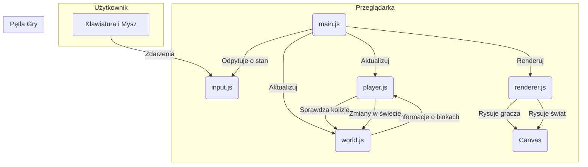

# Projekt Techniczny: Prototyp Gry 2D Minecraft

Ten dokument opisuje architekturę i projekt techniczny dla prototypu gry 2D, opartego na wymaganiach funkcjonalnych i niefunkcjonalnych.

## 1. Struktura Katalogów i Plików

Projekt będzie zorganizowany w następujący sposób, aby zapewnić separację odpowiedzialności i łatwość w zarządzaniu kodem:

```
project/
|-- lekcja_3/
|   |-- index.html              # Główny plik HTML, który ładuje grę
|   |-- css/
|   |   |-- style.css           # Style dla interfejsu (np. hotbar, tło)
|   |-- js/
|   |   |-- main.js             # Główny plik inicjujący grę (game loop)
|   |   |-- config.js           # Konfiguracja gry (np. rozmiar świata, prędkość gracza)
|   |   |-- world.js            # Moduł zarządzający stanem świata (bloki)
|   |   |-- player.js           # Moduł zarządzający stanem i logiką gracza
|   |   |-- renderer.js         # Moduł odpowiedzialny za rysowanie wszystkiego na canvasie
|   |   |-- input.js            # Moduł obsługujący wejście od użytkownika (klawiatura, mysz)
|   |-- assets/                 # Katalog na zasoby graficzne (sprite'y)
|       |-- player.png
|       |-- blocks.png
```

## 2. Architektura Modułowa

Aplikacja zostanie podzielona na logiczne moduły (pliki JavaScript), z których każdy będzie miał jasno zdefiniowaną odpowiedzialność.

### `main.js` - Główny silnik gry
- **Odpowiedzialność:** Inicjalizacja gry, uruchomienie i zarządzanie główną pętlą gry (game loop).
- **Logika:**
    1.  Inicjalizuje canvas i kontekst renderowania.
    2.  Tworzy instancje `World`, `Player`, `Renderer` i `InputHandler`.
    3.  Uruchamia pętlę gry, która w każdej klatce:
        -   Przetwarza wejście od gracza (`input.js`).
        -   Aktualizuje stan gracza i świata (`player.js`, `world.js`).
        -   Renderuje zaktualizowany stan na ekranie (`renderer.js`).

### `config.js` - Konfiguracja
- **Odpowiedzialność:** Przechowywanie stałych i parametrów konfiguracyjnych gry.
- **Przykładowe dane:** `CANVAS_WIDTH`, `CANVAS_HEIGHT`, `BLOCK_SIZE`, `PLAYER_SPEED`, `GRAVITY`.

### `world.js` - Zarządzanie Światem
- **Odpowiedzialność:** Przechowywanie i zarządzanie stanem siatki bloków.
- **Kluczowe funkcje:**
    -   `generateWorld()`: Tworzy początkową mapę gry.
    -   `getBlock(x, y)`: Zwraca typ bloku na danej koordynacie.
    -   `setBlock(x, y, type)`: Ustawia nowy blok (budowanie).
    -   `removeBlock(x, y)`: Usuwa blok (niszczenie).

### `player.js` - Logika Gracza
- **Odpowiedzialność:** Zarządzanie stanem, pozycją i fizyką gracza.
- **Kluczowe właściwości:** `x`, `y`, `vx`, `vy` (pozycja i prędkość), `inventory`.
- **Kluczowe funkcje:**
    -   `update(deltaTime, world)`: Aktualizuje pozycję gracza, uwzględniając grawitację i kolizje ze światem.
    -   `move(direction)`: Zmienia prędkość poziomą gracza.
    -   `jump()`: Nadaje graczowi prędkość pionową.

### `renderer.js` - Renderowanie Grafiki
- **Odpowiedzialność:** Rysowanie stanu gry na elemencie `<canvas>`.
- **Kluczowe funkcje:**
    -   `drawWorld(world)`: Rysuje wszystkie bloki ze świata.
    -   `drawPlayer(player)`: Rysuje postać gracza.
    -   `clear()`: Czyści canvas przed narysowaniem nowej klatki.

### `input.js` - Obsługa Wejścia
- **Odpowiedzialność:** Nasłuchiwanie na zdarzenia klawiatury i myszy i przekazywanie ich do odpowiednich modułów.
- **Logika:**
    -   Rejestruje event listenery dla `keydown`, `keyup`, `mousedown`.
    -   Przechowuje stan wciśniętych klawiszy.
    -   Udostępnia metody do sprawdzania stanu klawiszy (np. `isKeyDown('KeyA')`).

## 3. Przepływ Danych

Diagram poniżej ilustruje podstawowy przepływ danych i interakcje między modułami w każdej klatce gry.



Ten projekt zapewnia solidne podstawy do budowy prototypu, umożliwiając łatwą rozbudowę w przyszłości.